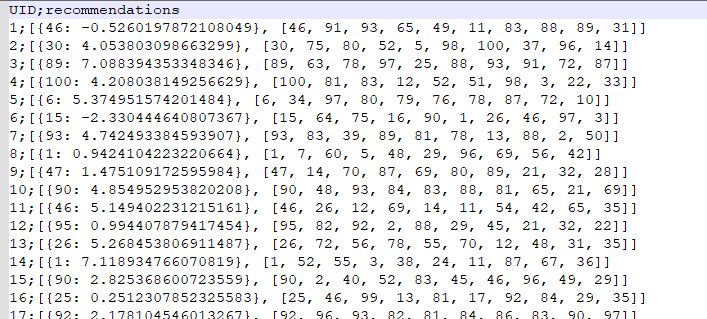
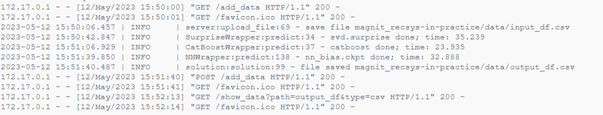
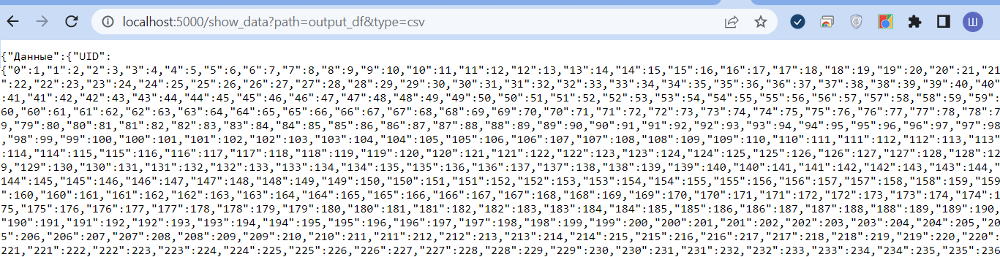

# magnit_recsys-in-practice


Файл с результатом имеет следующий вид:<br>
<picture></picture>

Собрать образ:<br>
```
docker build --pull --rm -f "Dockerfile" -t a-shishkin "."
```
Запустить контейнер:<br>
```
docker run --rm -d -p 5000:5000 --name a-shishkin a-shishkin:latest
```
После запуска контейнера можно загрузить файл по url
```
http://localhost:5000/add_data
```
После загрузки файла начнется выполнение скрипта, результат сохраняется в файле `/magnit_recsys-in-practice/data/output_df.csv`<br>
Разделитель - ;<br>

Логи сервиса:<br>
<picture></picture>

Скопировать результат:<br>
```
docker cp a-shishkin:/magnit_recsys-in-practice/data/output_df.csv output_df.csv
```

Показать содержимое файла:<br>
```
http://localhost:5000/show_data?path=output_df&type=csv
```
<picture></picture>